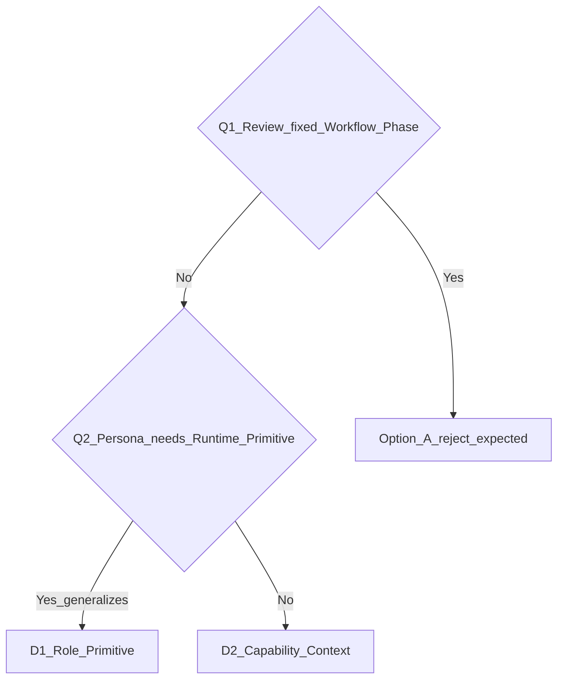

# ADR-013: Cognitive Role Primitive Gate (Review as First Consumer)

## Status

**Completed** (2026-07-07, Phase 2.3 debt payoff)

> **Scope closed.** Stance value taxonomy growth → [`ADR-014`](ADR-014-cognitive-stance-capability-context.md). Do not extend ADR-013; use Architecture Evolution Pattern documented in plan Phase 2 close-out.

## Framework Generation

- **世代分類**：Gen 3 — Cognitive Execution System 子系統邊界擴充候選
- **當前世代文件**：[`architecture/ai-native-cognitive-execution-system.md`](../architecture/ai-native-cognitive-execution-system.md)；[`constitution/ADR-008-runtime-cognitive-modes.md`](ADR-008-runtime-cognitive-modes.md)（既有 4 維 `cognitive_mode` primitive）
- **適用狀態**：D1 **rejected**；D2 **accepted** — capability context may carry bounded `context.stance`. **ADR-013 closed** — implementation complete Phase 1–2. Stance **value taxonomy** → [`ADR-014`](ADR-014-cognitive-stance-capability-context.md) (Proposed).

## Date

2026-07-06

## Source Plan

- [`plans/archived/2026-07-06-review-architecture-adr/_plan.md`](../plans/archived/2026-07-06-review-architecture-adr/_plan.md)
- [`plans/archived/2026-07-06-review-architecture-adr/01-phase0b-perspective-generalization-evidence.md`](../plans/archived/2026-07-06-review-architecture-adr/01-phase0b-perspective-generalization-evidence.md) — Phase 0b evidence
- [`plans/archived/2026-07-06-review-architecture-adr/02-phase0b5-perspective-taxonomy-validation.md`](../plans/archived/2026-07-06-review-architecture-adr/02-phase0b5-perspective-taxonomy-validation.md) — Phase 0b.5 / 0d stance evidence
- [`constitution/ADR-014-cognitive-stance-capability-context.md`](ADR-014-cognitive-stance-capability-context.md) — stance value taxonomy (Proposed)

## Context

### Trigger: software-delivery 三層契約不一致

| 層 | 現況 |
|---|---|
| **Governance** | [`software-delivery-governance.md`](../governance/ai-runtime-governance/software-delivery-governance.md) — Artifact completeness 含 review report |
| **Execution** | [`execution-flow.yaml`](../workflow/software-delivery/execution-flow.yaml) — 無 review loading surface；步驟在 implementation 後直接 `validate_and_close` |
| **README** | [`workflow/software-delivery/README.md`](../workflow/software-delivery/README.md) — review-checklist 為「需要時參考」 |
| **Routing** | [`routing-registry.yaml`](../knowledge/runtime/routing-registry.yaml) — `code-review` / `design-review` triggers 存在，required_dependencies **不含** review surface |

### Deeper gap: AI 無 Reviewer 執行模型

Agent 在 software-delivery 任務中常見路徑：

```text
Implement → Run tests → Finish
```

缺少可發現的 **persona 切換**（停止實作、findings-only、產 review report）。此缺口觸發本 ADR，但 **解法是否為新 Runtime Primitive 尚未證明**。

### Review 的 lifecycle 分布（反對單一 Workflow Phase）

| Review 類型 | 典型時機 | Caller 上下文 |
|---|---|---|
| Contract / API design review | 平行實作前 | `sd-contracts` / `sd-ui-contracts` |
| Architecture review | 架構決策後 | `architecture/` |
| Security review | API/Auth 設計後 | contracts / implementation |
| Code review | 實作完成後 | `sd-implementation` |
| Performance review | PR / perf-sensitive | `sd-test-strategy` / perf-risk-gate |
| Release review | 發布/合併前 | `sd-validation` / `sd-closure` |

**共同點不是同一時間點，而是同一類行為：以 Reviewer 視角執行檢查並產可追溯 artifact。**

### 與 ADR-008 的關係

[`cognitive_mode`](../models/cognitive-modes/README.md)（ADR-008）描述 **如何**執行（FAST/DEEP、SUMMARY_FIRST、STRICT …）。  
本 ADR 評估的是 **是否**需要獨立的 **誰在執行** primitive（`cognitive_role`），或是否可用 **capability invoke + context** 表達。

兩者應保持 **正交**（若 D1 成立）：

```text
cognitive_role: Reviewer
cognitive_mode: DEEP + SOURCE_BACKED + STANDARD + NONE
capability: code-review
```

---

## Primary Question

> **Does the Cognitive System need a new Runtime Primitive: Cognitive Role?**

| 答案 | 含義 |
|---|---|
| **Yes (D1)** | `cognitive_role` 與 `cognitive_mode` 並列；Review 為 **第一個 consumer**；Planner / Debugger 等可共享 |
| **No (D2 / B)** | Persona 以 **capability context** 表達；不擴張 routing/runtime/graphs/overlays 的 primitive 表面 |

「Review 是什麼？」是 **derivative**。「Role 要不要成為 primitive？」是 **primary**。

---

## Decision Tree

```text
Q1: Is Review a fixed Workflow Phase (single lifecycle slice)?
    Yes → Option A (sd-review) — evaluate
    No  → continue

Q2: Does persona separation require a new Runtime Primitive?
    Yes AND generalization test passes → D1 (cognitive_role primitive)
    No OR review-only special case      → D2 (capability + context) → B fallback
```



---

## Five Required Answers

| # | Question | Draft answer | Evidence / notes |
|---|---|---|---|
| 1 | Review 是否跨 Workflow？ | **Yes** | 表見 Context §lifecycle 分布 |
| 2 | Review 是否需要 Persona 切換？ | **Yes** | 停止 feature coding；findings-only；report artifact |
| 3 | Persona 是否需要 **Runtime Primitive**？ | **No** | Phase 0b — `context.stance` sufficient; see Generalization Test |
| 4 | Capability 是否足以表達 Reviewer Context？ | **Yes** | D2 invoke envelope |
| 5 | 新 Primitive 是否泛化到其他 Domain？ | **No** | Phase 0b — slice/mode/objective cover most activities |

---

## Generalization Test

> **Phase 0b complete** — full evidence: [`plans/archived/2026-07-06-review-architecture-adr/01-phase0b-perspective-generalization-evidence.md`](../plans/archived/2026-07-06-review-architecture-adr/01-phase0b-perspective-generalization-evidence.md)

### Phase 0b method

- Test **non-Review** activities and **counter-examples** (Refactoring, Documentation, Test authoring)
- Success = define **Role boundary**, not only pro-Role cases
- Separate: **Review ≠ Workflow Phase** (proven) vs **Role ≠ Runtime Primitive** (tested here)

### Activity × placement matrix (summary)

| Activity | Workflow phase? | Capability enough? | Role more natural? | Conclusion |
|---|---|---|---|---|
| Review | No | △ needs `perspective` | Yes | **Perspective candidate** |
| Planning | No (slice owns) | Yes | △ overlaps intake | **Capability / slice** |
| Debugging | No | △ + FORENSIC mode | △ **not falsified** | **Perspective candidate — Phase 0b.5** |
| Architecture fit | No (slice owns) | Yes | No | **Slice** |
| Validation | No (slice owns) | Yes | No | **Slice** |
| Refactoring | No | Yes (`execution_mode`) | No | **Counter-example** |
| Documentation | No | Yes | No | **Counter-example** |
| Test authoring | No | Yes | △ weak | **Counter-example** |

### Promotion rule outcome (Phase 0b)

- **≥3 activities share stable role primitive semantics?** → **No**
- **Only Review (+ Debugger under test) show perspective switch?** → **Under Phase 0b.5**
- **Strong counter-examples?** → Refactoring, Documentation, Planning (slice), Architecture (slice)

**Phase 0b updates Q3 / Q5:**

| # | Question | Phase 0b answer |
|---|---|---|
| 3 | Persona needs Runtime Primitive? | **No** — `context.stance` sufficient |
| 5 | Generalizes to other domains? | **No** — slices / modes / objectives already cover most |

### Role taxonomy explosion risk

若 Role 成 primitive 而無 bounded catalog，預期膨脹：

`Tester → Refactorer → Optimizer → Writer → Documenter → …`

D1 **必須**附帶 **bounded role catalog policy** 與新增 role 的 ADR/plan gate，否則 reject。

---

## Evaluation Criteria

| Criteria | 說明 |
|---|---|
| Lifecycle Independence | 跨 Requirements / Architecture / Implementation / Release 的 review |
| Cognitive Separation | Reviewer vs Implementer 真正分離 |
| Discoverability | AI 知何時 invoke review |
| Extensibility | 新增 UX/Compliance review 成本 |
| Contract Clarity | workflow contract 保持 thin |
| Runtime Cost | routing/loading 維護 |
| **Primitive Justification** | 獨立語意 + 跨 domain 泛化 |

### Scoring matrix (Phase 0 draft — not final)

Legend: `S` strong · `A` adequate · `W` weak · `F` fails · `O` open

| Criteria | A | B | C | D1 | D2 |
|---|---|---|---|---|---|
| Lifecycle Independence | W | S | W | S | S |
| Cognitive Separation | A | W | A | S | A |
| Discoverability | W | A | W | S | A |
| Extensibility | W | S | W | S | S |
| Contract Clarity | W | S | F | S | S |
| Runtime Cost | A | S | W | W | S |
| Primitive Justification | F | A | F | **F** | S |
| **Overall (Phase 0b)** | reject | fallback | reject | **reject** | **recommend** |

> Phase 0b evidence: [`01-phase0b-perspective-generalization-evidence.md`](../plans/archived/2026-07-06-review-architecture-adr/01-phase0b-perspective-generalization-evidence.md)

---

## Options

### Option A — Workflow Phase (`sd-review`)

- Review = 單一 lifecycle slice + post-implementation Review Gate
- **預期 reject**：pre-impl review 錯置；lifecycle 綁定錯誤

### Option B — Cross-cutting Capability

- `workflow/cross-cutting/review/` + per-slice `review_invocation`
- 無 persona primitive
- **Fallback** 若 D1 未通過

### Option C — Hybrid (slice hook + capability body)

- **退化路徑**：Hook → Capability → Review Workflow → Gate → 回到 Option A
- **預期 reject** 除非 anti-degeneration 邊界可證明

### Option D1 — Role as Runtime Primitive

```text
Workflow → cognitive_role (primitive) → review capability → artifact
```

- 新增 `governance/cognitive-role.md`（living spec，accept 後）
- routing / runtime / graphs / overlays **須**理解 role — **高承諾**
- **條件接受**：Q2=Yes 且 Generalization Test 通過且 bounded catalog

### Option D2 — Cognitive Stance as Capability Context (Accepted)

```text
Workflow → review capability → context.stance → artifact
```

```yaml
# Canonical invoke envelope (Phase 0d)
invoke:
  capability: code-review
  context:
    stance: fault_finding    # bounded: fault_finding | default (see ADR-014)
    caller_slice: sd-implementation
```

- **Role / Actor 不是第一級概念**
- 與 `cognitive_mode` 正交：`stance` = reasoning stance（epistemic），非 actor perspective
- Phase 0b.5 working label `perspective` **deprecated** — final field name **`stance`**
- Stance **values** beyond `fault_finding | default` → [`ADR-014`](ADR-014-cognitive-stance-capability-context.md)

---

## Primitive Promotion Cost (D1 only)

若 `cognitive_role` 晉升為 runtime primitive，下列表面 **必須**同步設計（不可 silent 擴張）：

- `knowledge/runtime/routing-registry.yaml` — activation / loading
- `runtime/runtime.db` — 若未來投影（需另 plan）
- `knowledge/graphs/*` — workflow edges
- project overlays — Brower 等 consumer
- glossary — `cognitive_role` vs `cognitive_mode` 不混淆

**Primitive 一旦建立很難刪。** 本 ADR 在 accept D1 前不寫入上述任何機械表面。

---

## Review Type × Invocation Point (shared by D1/D2)

| Review type | Caller workflow | D1 role switch | D2 invoke |
|---|---|---|---|
| Contract review | `sd-contracts` | Designer → Reviewer | `contract-review` + `stance: fault_finding` |
| Architecture review | `architecture/` | Architect → Reviewer | `architecture-review` + `stance: fault_finding` |
| Security review | contracts / impl | Implementer → Reviewer | `security-review` + `stance: fault_finding` |
| Code review | `sd-implementation` | Implementer → Reviewer | `code-review` + `stance: fault_finding` |
| Performance review | test-strategy / perf-risk-gate | Implementer → Reviewer | `performance-review` + `stance: fault_finding` |
| UI / compliance review | `sd-ui-governance` | Implementer → Reviewer | `ui-review` + `stance: fault_finding` |
| Release review | `sd-validation` / `sd-closure` | Validator → Reviewer | `release-review` + `stance: fault_finding` |

---

## Recommendation (Phase 0d — final)

> **Review is not a Workflow Phase** — proven (Phase 0a).
>
> **Reject D1 (Accepted):** `cognitive_role` runtime primitive is **not justified**. Rejection is because Role does not generalize — not because Review is special.
>
> **Accept D2 (Accepted):** Cross-cutting review capabilities with bounded **`context.stance`**. Closes the software-delivery review gap without promoting `cognitive_role` to a runtime primitive.
>
> **Stance field (Accepted):** Capability context **may** carry `stance`. Currently standardized value: **`fault_finding`**. Omitted or explicit **`default`** for forward work. **Do not** use actor labels (`reviewer`) or premature buckets (`constructive_build`).
>
> **Stance taxonomy (Deferred to ADR-014):** ADR-013 answers *whether the field exists*; [`ADR-014`](ADR-014-cognitive-stance-capability-context.md) answers *what values are legal* and governs future enum growth.

---

## Decision

**Accepted (Phase 0d, 2026-07-06)**

| Outcome | Status |
|---|---|
| **Reject D1** (`cognitive_role` primitive) | **Accepted** |
| **Reject Option A, C** | **Accepted** |
| **Accept D2** (capability + `context.stance`) | **Accepted** |
| **Reject `perspective: reviewer`** | **Accepted** — use `stance: fault_finding` |
| **Reject `constructive_build` enum** | **Accepted** — evidence insufficient; use `default` |
| **ADR-014 for stance taxonomy** | **Recommended** — Proposed |

### Context contract (ADR-013 scope)

Capability invoke context **may** carry a bounded cognitive **`stance`**. Currently the only standardized non-default value is **`fault_finding`**. All other forward activities use **`default`** (explicit or omitted) until a future stance family is evidenced and accepted via ADR-014.

Rejected paths:

| Outcome | Status |
|---|---|
| **Accept D1** | **Rejected** — requires new counter-evidence |
| **Accept B only** (capability without stance envelope) | **Superseded by D2** |

---

## Consequences

### If D1 accepted

- Review = first `cognitive_role` consumer
- `workflow/cross-cutting/review/` — capability bodies
- Per-slice `role_switch` + `review_invocation` hooks (thin)
- Glossary: `cognitive_role` (distinct from `cognitive_mode`)
- **No** `sd-review` lifecycle slice

### D2 accepted — implemented (Phase 1–2 complete)

- `workflow/cross-cutting/review/` — capability bodies ✅
- Per-slice `review_invocation` with capability invoke ✅
- **Workflow isolation:** workflows invoke capabilities; they **must not branch on `context.stance`** ✅
- Runtime Contract + Navigation Alignment + Regression + Drift Lock + Debt Payoff ✅
- **No** routing/runtime primitive expansion ✅
- **No** `sd-review` lifecycle slice ✅
- Stance value growth → **ADR-014** only

### Either path — shared fixes (complete)

- Migrate [`review-checklist.md`](../workflow/software-delivery/review-checklist.md) under cross-cutting ✅
- Fix [`validation.md`](../workflow/software-delivery/validation.md) misplaced review-report ownership ✅
- Align governance Artifact completeness language — deferred minor; capability owns review report
- Validation scenarios updated to cross-cutting paths ✅

### Rejected (Phase 0)

- Option A — single post-impl `sd-review` slice as primary model
- Option C — hybrid without anti-degeneration proof
- Review-only primitive without generalization test pass

---

## Related

- [`constitution/ADR-008-runtime-cognitive-modes.md`](ADR-008-runtime-cognitive-modes.md)
- [`constitution/ADR-009-cognitive-slice-taxonomy.md`](ADR-009-cognitive-slice-taxonomy.md)
- [`workflow/cross-cutting/README.md`](../workflow/cross-cutting/README.md)
- [`governance/cognitive-slice-taxonomy.md`](../governance/cognitive-slice-taxonomy.md)
- [`knowledge/glossary/ai-skill.md`](../knowledge/glossary/ai-skill.md) — `validation_capability`（cross-cutting capability 先例）
- [`constitution/ADR-014-cognitive-stance-capability-context.md`](ADR-014-cognitive-stance-capability-context.md)
- [`workflow/software-delivery/review-checklist.md`](../workflow/software-delivery/review-checklist.md)

## Open Questions (deferred — ADR-014 / Phase 1)

1. ~~Stance field name~~ — **closed:** `stance` (not `perspective`)
2. ~~`fault_finding` vs `reviewer`~~ — **closed:** `fault_finding`
3. ~~`constructive_build` enum~~ — **closed:** rejected; use `default`
4. Peer review vs self-review — same capability + context flag?
5. Mechanical enforcement — advisory vs transition-block (Phase 1)
6. Future second stance family — evidence bar (ADR-014)
