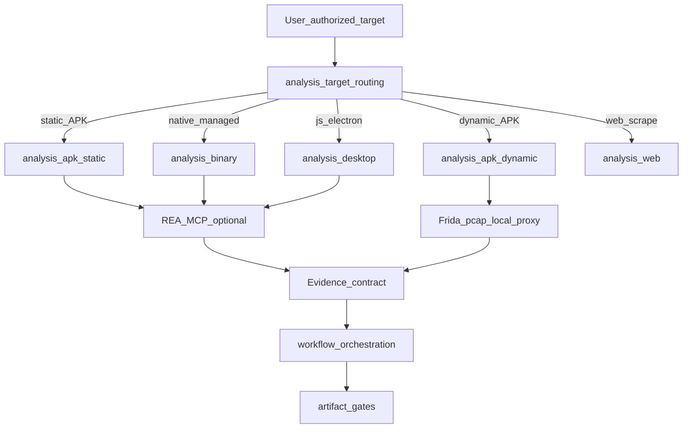

# REA → Ai-skill Analysis Capability Hardening（全量落地）

**Status**: `draft`

**Stakeholder 定界（2026-10-10）**：使用者要求 **全部都要**——analysis 方法、工具接線、routing、workflow／artifact gates，以及 REA 有而我們沒有的目標域（native、JS/Electron、managed/.NET、firmware、EVM、crash、process、Evidence 契約等）。本 plan 先凍結「怎麼落地、落地什麼」；**實作依 phase 執行，不以整包 vendor REA 取代既有 APK 動態主線**。

**外部參考（非 canonical）**：[`https://github.com/morluto/rea`](https://github.com/morluto/rea)（REA / `rea-agents`，MIT；本地 MCP+CLI；Evidence-first）。版本漂移快——任何工具名以當時連線的 `binary_session` / `tools/list` 為準，本 plan 只鎖**能力類別**與 Ai-skill 分層位置。

**Glossary Impact**: yes — 預定引入（candidate，Phase 0/1 定稿後再寫入 glossary）：`shipped_artifact_evidence`、`residual_unknown`、`analysis_provider_binding`、`reconstruction_obligation`。若最終只用既有 `evidence_chain` 語彙擴充則降為 no 並回寫本列。

## Decision Rationale

### Problem & Why Now

1. 我們的 reverse 深度集中在 **`analysis/apk` 動態路徑**（Frida、traffic triage、Flutter/Unity、local proxy），靜態 JADX／native 偽碼／Electron／跨目標 Evidence 契約偏薄或僅工具名列點。
2. REA 提供 agent 可呼叫的 **MCP 工具面 + Evidence／unknowns 紀律 + 多目標路由 skill**，正好補「如何用引擎取證」的缺口，但**不是**可重用 knowledge OS，也不能覆蓋我們已沉澱的動態失敗判讀。
3. 若只裝 MCP 不寫 Ai-skill，agent 會跟 REA skill 走、繞過我們的 authorization／sanitization／layering；若只抄 REA docs 進 `analysis/`，會變成 tool-coupled 與授權風險。
4. 使用者要全量：需要一份 **分層＋分 phase** 的落地圖，避免一次塞爆 `analysis/apk` 或誤開與動態主線衝突的 workflow。

### Decision

採用 **「REA = 可選執行引擎；Ai-skill = canonical 方法／流程／授權」** 全量硬化，分三條帶同步推進：

| 帶 | 內容 | Canonical 位置 |
| --- | --- | --- |
| **Methods** | 目標分流、取證步驟、失敗判讀、Evidence／unknowns 品質 | `analysis/*`（新建域 + 強化 apk） |
| **Tool adapter** | Cursor／MCP 安裝、doctor、JADX/Ghidra/Hopper 前置、**不**複製 REA skill 全文 | `ai-tools/agent/cursor.md` + 可選 `ai-tools/rea-mcp.md` |
| **Orchestration + runtime** | 端到端入口、artifact gates、routing discovery | `workflow/` + `knowledge/runtime/routing-registry.yaml` + 必要 validation scenarios |

硬邊界（全 phase 不變）：

- 僅 **已授權** 標的（[`enforcement/authorization-scope.md`](../../../enforcement/authorization-scope.md)）。
- 不把 REA skill／prompts 鏡像進 `analysis/` 或 `workflow/`；只抽取**工具中立**方法與契約。
- **不取代** Flutter AOT／Unity IL2CPP／Frida／TUN／local-proxy 主線；REA Android 明確不執行 APK、不做 native-lib／runtime capture——文件必須標 `not applicable`／handoff 回我們的動態路徑。
- 原始 APK／binary／HAR 證據留業務專案；進庫必須去敏（[`reusable-guidance-boundary.md`](../../../enforcement/reusable-guidance-boundary.md)）。

### Alternatives Considered

- **A. 只裝 REA MCP、不改 Ai-skill**：reject——授權／分層／APK 動態知識會被外部 skill 架空。
- **B. 整包 vendor REA docs／skill 進庫**：reject——tool-coupled、授權與去敏風險、與 content-layering 衝突。
- **C. 只強化 `analysis/apk`、忽略其他目標**：reject——使用者要求全量；且 Electron／native 缺口真實存在。
- **D. 漸進全量（accept）**：先 inventory＋對應表＋Evidence 契約，再依域開 analysis → adapter → route → workflow。

### Why Not an ADR Yet

尚未 dogfood 證明「跨目標 Evidence 契約」與既有 `apk-evidence-chain` 的收斂形狀；Open Questions（路由命名、是否獨立 `workflow/reverse-engineering`）未解。適合 plan + 試跑後再決定是否 ADR。

### ADR Promotion Criteria（completed 時驗證）

- [ ] foundational + cross-session + cross-project + expensive-to-reverse + explains-why 全中
- [ ] 至少兩個目標族（例如 static APK + JS/Electron 或 native）完成 dogfood 且 Evidence 契約一致
- [ ] Open Questions 全解或明確 deferred
- [ ] 沒有更輕 promotion target（僅 analysis README 不夠解釋跨層契約時才 ADR）

### Consequences（預期）

#### 正面

- Agent 對 shipped artifact 有統一「觀察／推論／unknown」紀律。
- 靜態與動態路徑可交接，不再二選一互斥。
- 新目標域有明確 layer 家，避免全部塞進 apk。

#### 負面

- 文件與 route 表面積上升；需 document-sizing 與 summary-first。
- 依賴外部工具（JADX JAR、Ghidra/Hopper）——Ai-skill 只描述前置，不安裝引擎。

#### 風險

- REA API／tool 名漂移 → 對應表寫「能力類別 + 查 live catalog」，禁止鎖死舊 npm 版本為唯一真相。
- 誤把 REA 動態／靜態邊界寫錯 → Phase 2 強制寫「Android static ≠ our dynamic」。
- 授權繞過 → 每個新 workflow 入口第一步強制 authorization gate。

## 分析結論摘要（Freeze 用）

### REA 能力族 vs 我們現況

| 能力族 | REA 提供（摘要） | Ai-skill 現況 | 缺口處置 |
| --- | --- | --- | --- |
| Static Android (JADX) | `inspect_android_*`、refs、Evidence | `jadx` 列於 tools；缺 agent 步驟／Evidence 品質 | **強化** `analysis/apk` + workflow handoff |
| Dynamic Android | （明確不做） | Frida／traffic／Flutter／Unity 強 | **保留**；對應表標 N/A→handoff |
| Native binary | Hopper/Ghidra/IDA、pseudocode、xref、calls | 僅工具名 | **新建** `analysis/binary/` |
| Offline ELF / crash | layout、core notes | 無 | **納入** `analysis/binary/` |
| Managed /.NET / NativeAOT | static CLI + Ghidra NativeAOT | 無 | **納入** `analysis/binary/` 或 `analysis/managed/`（Phase 0 定名） |
| JS / Electron static | module graph、IPC、source maps | `analysis/web` 偏 scraping | **新建** `analysis/desktop/` 或 `analysis/javascript-artifacts/`（Phase 0 定名） |
| Browser / Electron runtime | passive CDP observation | web 有 browser 工具但非 shipped-app RE | **擴** web 或併入 desktop |
| Network captures | HAR / mitmproxy inspect | apk traffic + web；缺通用 HAR Evidence 方法 | **跨域** `analysis/` evidence 方法 + apk handoff |
| Firmware / EVM | regions、bytecode selectors | 無 | **新建** stub 域（後段 phase） |
| Process capture | bounded PTY experiment | 無 | **納入** binary 或 desktop runtime |
| Evidence / unknowns / reconstruction ledger | 一等公民 | apk artifact-gates 有 evidence-chain，非跨目標 | **新建** cross-cutting analysis 方法（優先） |
| MCP prompts | investigate_feature 等 6 個 | 無對等 | **不複製 prompt**；workflow 步驟對應其意圖 |

### 建議目錄形狀（實作時依 Phase 0 定稿）

```text
analysis/
  reverse-engineering/          # 可選 umbrella README：目標分流 + Evidence 契約入口
    README.md
    evidence-contract.md        # digest / authority / limitations / residual unknowns
    target-routing.md           # 何時用 static APK / native / JS / firmware…
  apk/                          # 既有 + static-jadx-agent-path.md + REA 邊界註記
  binary/                       # native / ELF / crash / managed
  desktop/                      # JS-Electron artifacts + passive runtime（名稱 Phase 0 定）
  firmware/                     # stub → 完整方法
  evm/                          # stub → 完整方法
workflow/
  apk-analysis/                 # 加 static-first 分支，不刪動態
  reverse-engineering/          # 新：跨目標 orchestration（若 Phase 0 選定獨立 workflow）
ai-tools/
  rea-mcp.md                    # 安裝／doctor／前置；連回 analysis／workflow
  agent/cursor.md               # 短 pointer
```



## REA → Ai-skill 對應表（落地索引；實作時拆檔維護）

| REA 意圖 / 工具族 | Ai-skill 放置 | 備註 |
| --- | --- | --- |
| `inspect_android_package/class/method` + refs | `analysis/apk/static-jadx-path.md`（新）+ tools-and-failures 更新 | 靜態；完結後可升級動態 |
| `open_binary` / `binary_overview` / decompile / xref | `analysis/binary/native-investigation.md` | provider = Hopper/Ghidra/IDA |
| `inspect_binary_layout` / `inspect_recorded_crash` | `analysis/binary/offline-layout-and-crash.md` | 無 live attach |
| `inspect_managed_artifact` / NativeAOT | `analysis/binary/managed-code.md` | |
| `analyze_javascript_application` / feature trace / version compare | `analysis/desktop/`（或定名後路徑） | 與 `analysis/web` scraping 分界 |
| `list_browser_targets` / Electron observe / HAR | desktop + `analysis/web` 交叉連結 | credentials 排除要寫進方法 |
| firmware / EVM tools | `analysis/firmware/`、`analysis/evm/` | 後段 |
| `record_unknown` / compare_* / `verify_reconstruction` / obligation ledger | `analysis/reverse-engineering/evidence-contract.md` + 對齊 apk evidence-chain | 跨域優先 |
| MCP prompts（6） | `workflow/*/execution-flow` 步驟意圖，不貼 prompt 原文 | |
| `npx rea-agents setup` / doctor | `ai-tools/rea-mcp.md` | P3；canonical 方法不依賴 setup 成功 |

## Runtime Execution Path

本 plan **不是** doc-only 終局：完成時必須有可發現 route 與（對新 workflow）execution entry。分階段接入：

| Phase | Runtime 動作 | Consumer |
| --- | --- | --- |
| 1–5 | 可先 doc-only trial；**不得**宣稱已 runtime-integrated | — |
| 6 | `ai-tools/rea-mcp.md` | Cursor adapter 人工／agent 閱讀 |
| 7 | 新增 `route.analysis.*`（及必要時 `route.workflow.reverse-engineering`）到 [`routing-registry.yaml`](../../../knowledge/runtime/routing-registry.yaml)，並 **同時** wire discovery signal 或明示 `manual_activation` | Discovery Bridge / preToolUse workflow gate |
| 8 | `workflow/.../execution-flow.md` + artifact-gates | `route.workflow.*` primary_source |
| 9 | validation scenarios（至少 static-vs-dynamic handoff、evidence unknowns） | `validation/scenarios/` |
| 10 | `ai-skill runtime compile`／refresh（若改 YAML contracts） | generated_surfaces consumers |

**Forbidden（對齊 system-upgrade-governance）**：只加 registry entry 不 wire discovery；只 project SQLite 無 consumer。

### Per-surface consumer 表（預定；Phase 7 填實）

| Generated surface / route key | Named consumer(s) | Consumer 類型 |
| --- | --- | --- |
| `route.analysis.reverse-engineering`（暫名） | Discovery Bridge signal：shipped-artifact / decompile / ghidra|jadx|hopper globs | discovery signal |
| `route.analysis.binary` | 同上 subset | discovery signal |
| `route.analysis.desktop`（暫名） | electron/asar/js-artifact signals | discovery signal |
| `route.workflow.reverse-engineering`（若獨立） | preToolUse primary_source gate | workflow gate |
| （若僅擴充 `route.workflow.apk-analysis`） | 既有 apk route + 新 static 分支文件 | 既有 consumer |

## Open Questions

| ID | 問題 | 預設（可在 Phase 0 改） |
| --- | --- | --- |
| Q1 | 跨目標 orchestration 用獨立 `workflow/reverse-engineering/` 還是擴充 `workflow/apk-analysis/` + 新 workflow 只服務 non-APK？ | **獨立** `workflow/reverse-engineering/`；apk-analysis 保持 APK 端到端，加 static 分支與 cross-link |
| Q2 | JS/Electron 域目錄名：`desktop` vs `javascript-artifacts`？ | **`analysis/desktop/`**（含 Electron；純 web scrape 仍歸 `analysis/web`） |
| Q3 | managed/.NET 併入 `binary/` 還是獨立 `managed/`？ | **先併入 `analysis/binary/managed-code.md`**，檔案變大再拆 |
| Q4 | Evidence 契約放 `analysis/reverse-engineering/` 還是 `workflow/cross-cutting/`？ | **分析品質方法放 analysis**；workflow 只引用 + artifact gate 切片 |
| Q5 | 是否強制本機安裝 REA 才能完成 plan？ | **否**——方法文件可先落地；MCP dogfood 為 Phase 10 acceptance，缺引擎標 `blocked` 不擋 methods merge |
| Q6 | Firmware/EVM 是否本 plan required_for_completion？ | **是（stub + 路由 + 最小方法）**；深度 dogfood 可 sub-plan deferred |
| Q7 | 與 [`evidence-candidate-system`](../2026-06-16-1131-evidence-candidate-system.md) 的收斂？ | Phase 1 讀後決定是否只連線、不重複造輪 |

## Stakeholder 同意項目

- [x] 全量範圍（methods + adapter + routing + workflow）
- [x] 先寫 plan，後依 phase 落地
- [ ] Phase 0 定稿 Q1–Q7（執行前 sign-off）
- [ ] 各 domain sub-plan（若拆）owner／lock
- [ ] Phase 10 dogfood 授權標的清單（具名、書面／口頭授權）

## Phase 0 — Architecture Compatibility Preflight + 定界

### Phase 0.0 — Open Questions 核對（公版，必填）

逐條核對本 plan §Open Questions，標記處置並回寫：

- [ ] 已讀本 plan §Open Questions 全部條目
- [ ] 對每條標記 `resolved`（附 Phase 0 證據）/ `still-open` / `deferred`（附原因）
- [ ] `resolved` 的條目已同步勾選 / 附註於 §Open Questions
- [ ] 若盤點新發現問題，已加入 §Open Questions

| Open Question | 處置 | 證據 / 原因 |
|---|---|---|
| Q1 workflow 形狀 | still-open | 預設獨立 reverse-engineering workflow |
| Q2 desktop 命名 | still-open | 預設 `analysis/desktop/` |
| Q3 managed 位置 | still-open | 預設併入 binary |
| Q4 evidence 層 | still-open | 預設 analysis reverse-engineering |
| Q5 REA 安裝強制 | still-open | 預設 methods 不依賴安裝 |
| Q6 firmware/EVM completion | still-open | 預設 stub 必達、deep dogfood 可 defer |
| Q7 evidence-candidate 收斂 | still-open | Phase 0 必讀該 plan／相關 docs |

### Phase 0.1 — Preflight checklist

| # | 檢查 | 動作 |
|---|---|---|
| 1 | Candidate paths | 確認 `analysis/`、`workflow/apk-analysis/`、`ai-tools/agent/cursor.md`、`routing-registry.yaml`、`enforcement/authorization-scope.md`、`content-layering.md` 存在 |
| 2 | Source-of-truth | 只改 Ai-skill canonical；不改業務專案 mirror；不 vendor REA git submodule |
| 3 | Layer responsibility | 方法→analysis；順序→workflow；MCP 路徑→ai-tools；判斷 atom→intelligence（後段） |
| 4 | Linked updates | 改 analysis README、workflow README、routing-registry、必要 summaries |
| 5 | Duplication risk | 對照 apk evidence-chain、web SPA discovery，避免平行矛盾契約 |
| 6 | Authorization | 每個新 execution-flow 第一步引用 authorization-scope |
| 7 | Document sizing | 新域用 folder+README，單檔避免混多目標 |

### Phase 0 完成條件

- [ ] Q1–Q7 有 resolved／deferred 註記
- [ ] 目錄命名定稿（寫進本 plan §建議目錄形狀）
- [ ] 列出 sub-plan 清單（見下）並建立 frontmatter（若當輪要拆）
- [ ] Preflight 表填完

## 預定 Sub-plans（執行時建立；frontmatter `parent` = 本 id）

| 建議檔名 | required_for_completion | sub_plan_reason |
| --- | --- | --- |
| `01-evidence-contract-and-target-routing` | true | 跨域 Evidence／unknowns／目標分流，阻塞所有域文件一致性 |
| `02-apk-static-jadx-and-handoff` | true | 強化既有 apk 靜態路徑與動態 handoff，獨立 acceptance |
| `03-binary-native-managed` | true | native/ELF/crash/managed 方法域，可平行於 desktop |
| `04-desktop-js-electron` | true | JS/Electron／passive runtime，可平行於 binary |
| `05-firmware-evm-stubs` | true | stub + 路由；深度 dogfood 可再拆 spike |
| `06-ai-tools-rea-mcp` | true | Cursor MCP adapter 文件與前置檢查 |
| `07-routing-and-workflow` | true | registry + workflow + artifact gates；依賴 01–06 方法入口存在 |
| `08-validation-intelligence-dogfood` | true | scenarios、必要 intelligence atoms、授權 dogfood |

## Phase 1 — Evidence 契約 + 目標分流（Methods 骨架）

**做什麼**

- 新建 `analysis/reverse-engineering/`（或 Phase 0 定名）：`README.md`、`evidence-contract.md`、`target-routing.md`
- 對齊／交叉連結 [`workflow/apk-analysis/artifact-gates/evidence-chain.md`](../../../workflow/apk-analysis/artifact-gates/evidence-chain.md)
- 讀 Q7 相關 evidence-candidate 文件，決定連線方式

**完成條件**

- [ ] 文件定義：observation vs inference vs residual unknown；artifact digest；provider identity；limitations
- [ ] `target-routing.md` 決策表覆蓋本 plan 能力族表
- [ ] `analysis/README.md` 增加入口
- [ ] 無 REA 專有工具名作為唯一路徑（可列「可選引擎：REA MCP／CLI」）

## Phase 2 — APK 靜態 JADX 路徑 + 動態 handoff

**做什麼**

- `analysis/apk/static-jadx-path.md`（agent 步驟：package → search → class → method → refs）
- 更新 `tools-and-failures.md`、`traffic-triage.md`（靜態結束何時升級動態）
- `workflows/` 可加 `static-jadx-flow.md`（analysis-local procedure）
- `workflow/apk-analysis/execution-flow.md` 加 static-first 分支與授權檢查

**完成條件**

- [ ] 明確寫出 REA Android **不做** runtime／native-lib／Frida
- [ ] handoff 條件表連到既有 frida／local-proxy／flutter 流程
- [ ] linked updates：apk README、workflows README

## Phase 3 — `analysis/binary/`

**做什麼**

- `README.md`、`native-investigation.md`、`offline-layout-and-crash.md`、`managed-code.md`、`tools-and-failures.md`
- 內容：provider 選擇、pseudocode 權威邊界、未知保留、process/native call 觀察的風險與授權

**完成條件**

- [ ] 方法可在無 REA 時用 Ghidra/IDA CLI 思路執行（REA 標 optional）
- [ ] 禁止未授權 live attach 的表述

## Phase 4 — `analysis/desktop/`（JS/Electron + passive runtime）

**做什麼**

- 與 `analysis/web` 分界：scraping vs shipped JS/Electron artifact reverse
- 靜態 graph／IPC／source map；passive CDP；HAR 通用方法（或 cross-link）
- 更新 `analysis/web/README.md` 雙向連結

**完成條件**

- [ ] 分界表完整
- [ ] credentials／cookie 不進 reusable docs 的規則寫明

## Phase 5 — Firmware + EVM stubs

**做什麼**

- `analysis/firmware/README.md`、`analysis/evm/README.md`：範圍、前置（binwalk/unblob、local bytecode）、unknowns、授權
- `target-routing.md` 掛上入口
- 深度案例 dogfood → 可另開 spike sub-plan（`required_for_completion: false`）

**完成條件**

- [ ] stub 足以讓 agent 不假裝有完整流程
- [ ] Q6 若 deferred deep dogfood，本 phase 仍勾完成

## Phase 6 — ai-tools REA MCP adapter

**做什麼**

- 新增 [`ai-tools/rea-mcp.md`](../../../ai-tools/rea-mcp.md)：Node 版本、`npx rea-agents setup`、doctor、JADX JAR／JAVA_HOME、Ghidra/Hopper、**備份既有 MCP config**、更新節奏
- [`ai-tools/agent/cursor.md`](../../../ai-tools/agent/cursor.md) 加短段落 pointer
- [`ai-tools/README.md`](../../../ai-tools/README.md) 索引

**完成條件**

- [ ] 明確：adapter 失敗不阻 analysis 方法使用
- [ ] 不複製 REA skill 正文
- [ ] tool-neutral 規則：generic 文件不強制 Cursor-only（細節留 ai-tools）

## Phase 7 — Routing registry

**做什麼**

- 依 Phase 0 命名註冊 `route.analysis.*`（及必要 workflow route）
- Wire activation_triggers／discovery；更新 model-checklists／summaries 若有流程要求
- 填實本 plan Per-surface consumer 表
- `ai-skill runtime` 相關 compile／validate（若有 YAML 變更）

**完成條件**

- [ ] 每個新 route 有 named consumer
- [ ] 與 `route.workflow.apk-analysis` 無錯誤搶訊號（參考 registry 既有 duplicate-signal 註解）

## Phase 8 — Workflow + artifact gates

**做什麼**

- 新建 `workflow/reverse-engineering/`（若 Q1 維持獨立）：`execution-flow.md`、README、artifact-gates（evidence、sanitization、authorization）
- 或擴充 apk-analysis + 薄 orchestration——以 Phase 0 決議為準
- Cross-link analysis 各域；**不**複製 analysis 全文

**完成條件**

- [ ] 入口第一步 authorization
- [ ] evidence gate 引用 Phase 1 契約
- [ ] apk 動態路徑未被刪改或削弱

## Phase 9 — Validation + intelligence（最小集）

**做什麼**

- validation scenarios：例如 static-to-dynamic handoff、evidence residual unknown、source-vs-REA-skill boundary
- 必要時 1–2 個 intelligence atoms（highest-leverage 擴到 shipped-artifact）

**完成條件**

- [ ] 至少 2 個 scenario YAML 可被既有 validation 入口發現
- [ ] 無 project-specific evidence

## Phase 10 — Dogfood + close-loop

**做什麼**

- 在**已授權**標的上：static APK 一輪；native 或 Electron 一輪（視環境有無 provider）
- 回寫失敗判讀到 tools-and-failures（去敏）
- Commit／push／readback；更新本 plan status → completed 後 archive

**完成條件**

- [ ] Dogfood 紀錄在 `evidence/`（plan-evidence 慣例）或明確 blocked（缺授權／缺引擎）
- [ ] `git status` clean 且已推送（若使用者授權 push）
- [ ] ADR Promotion Criteria 評估勾選或明示不 promote

## 完成條件（主計畫）

依 [`system-upgrade-governance`](../../../governance/lifecycle/system-upgrade-governance.md) 子集：

- [ ] Phase 0–10 完成條件全勾，或未勾項有 deferred + follow-up plan/spike
- [ ] `analysis/` 新域與 apk 強化已進庫且 README 索引完整
- [ ] `ai-tools/rea-mcp.md` 存在且 cursor adapter 有 pointer
- [ ] routing + workflow 已接入且 Per-surface consumer 表無空洞
- [ ] 授權／去敏邊界在每個 execution entry 可讀
- [ ] 未 vendor REA 全文；對應表維持能力類別層級
- [ ] Glossary Impact 已落實或改 no
- [ ] Close-loop：commit／push／readback（使用者授權下）

## 與其他 plans 的關係

| Plan | 關係 |
| --- | --- |
| [`apk-analysis-pilot` archived](../../archived/)（知識分層 pilot） | 本 plan 延續 W/A/I 分層，不回退 skills/ |
| [`2026-06-16-1131-evidence-candidate-system`](../2026-06-16-1131-evidence-candidate-system.md) | Evidence 契約收斂（Q7） |
| [`2026-07-08-0825-delegation-verification-arbitration-loop`](../2026-07-08-0825-delegation-verification-arbitration-loop/_plan.md) | 高利害重建／對照可選 DVA |
| Investment / legal domain plans | 形狀參考（intake + analysis + workflow），域不同 |

## Watch-Out List citation

對齊 [`architecture/ai-native-cognitive-ecosystem-system.md`](../../../architecture/ai-native-cognitive-ecosystem-system.md) §Watch-Out：防 scope drift（REA 版本追著改）、防 over-engineering（不重寫 JADX／Ghidra）、防把外部 skill 當 source of truth。

## 下一步（使用者確認後才執行）

1. 將本 plan `status` → `in-progress`，跑 Phase 0（Q1–Q7 定稿）。
2. 建立 sub-plan frontmatter 檔（01–08）。
3. 從 **Phase 1（Evidence + target routing）** 開始實作——不先大改 workflow。

**本輪交付**：僅建立本 draft plan；**尚未**改 `analysis/`／routing／安裝 REA。
